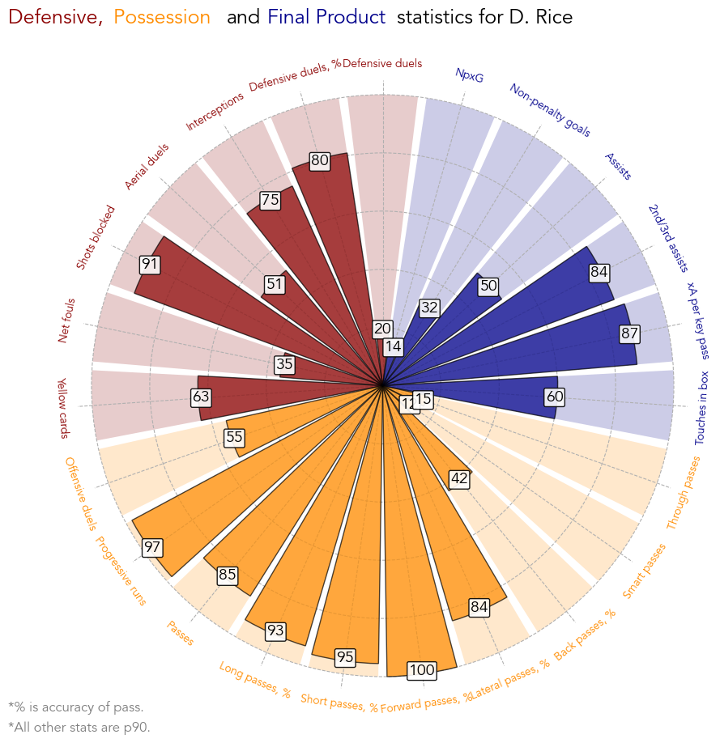
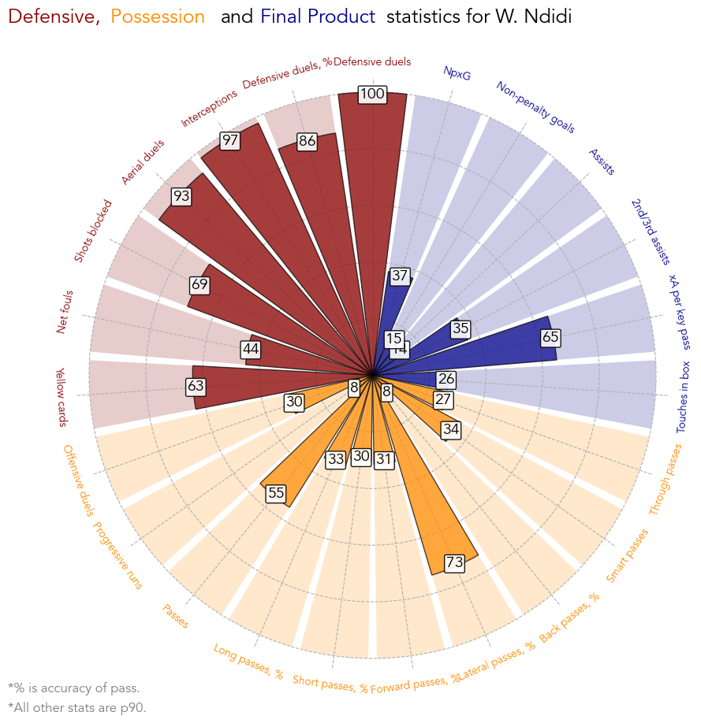

# Football Statistics Visualisation

This file contains three slightly different methods of visualising player's stats over a season. Examples are player radars, pizza plots and distribution plots. These can all be utilised slight differently to statistically flag players for scouting building on comparisons between players in similar leagues. Additionally, it can be used to compare player's statistics between different seasons in order to highlight how a player has developed over time to aid their development.

*All methods in this document are not assumed to be unique, but instead showcase personal constructions used to evaluate players. Specific details of code and presentation have been created by Oliver Whaites.*

*Data used for visualisations in this document has been sourced from Wyscout.*

## Data used

This file uses statistics of players from Wyscout. Specifically for Declan Rice and Wilfred Ndidi in the 2021-22 and 2020-21 Premier League seasons. The data is filtered by players who have played as a central midfielder (keyed as CMF, DMF in Wyscout) in these seasons. Any player that has played less than 1000 mins is truncated as they can have inflated statistics when normalising to per 90.

Unless stated otherwise, the statistics used are normalised to per 90 or percentage accuracy/success (denoted by ,%). Normalisation to per 90 helps judge players fairly, as someone who has played 4000 mins has had more opportunity to complete any statistic than someone who has played 2000 mins. Success percentages give a good indication of how 'good' a player is at that particular statistic. For example, a player may make a lot of long passes, but the true measure is how accurate those long passes are. Note that the quantity of the statistic does give insight into a player's playstyle. However, this type of statistic must be used carefully as players who have attempted few of a particular statistic (e.g few long passes) may have a skewed success percentage value.

## Player Radars

Player radars commonly used to evaluate the playstyle and quality of a player. Statistics are displayed in a radial plot format where the further the line/datapoint is away from the centre, the larger the numerical value of the statistic is. All players in the dataset are normalised in each statitsic, such that the outer values in the radar are the maximum in the dataset and the inner values are the minimum. For the majority of statistics, larger numeric values signify that how good a player is in that statistic. However, in general this is not always the case in some statitsics (e.g Yellow Cards, Fouls, ...). In order to evaluate the quality of a player, the base average level of players in the chosen league season are plotted as the mean values, denoted as a dahsed grey line. Below is an example of a player radar.

As an showcase, this radar compares the quality and playstyle of Declan Rice of West Ham United and Wilfred Ndidi of Leicester City for the 2021-2022 Premier League season. Differences in their radars gives insight into stengths in a player's game relative to another player or difference in playstyle. In the above radar, Declan Rice's passing statsistics are shown to exceed that of Ndidi's. Rice is shown to be one of the top players for passing accuracy stats in the 2021-2022 season, where he tops Forward pass accuracy. Whereas, Ndidi has sub-average passing stats in all catagories except for lateral passes. From this we can gather that Ndidi may not get involved in Leicester's build up play and may only shunt the ball to nearby midfielders. Rice on the other hand, may be seen in possession more and inspire some of West Ham United's build up play, echoed in his above average assisting based statistics. 

Furthermore, Ndidi has exceptional definding statistics making nearly 8 possession adjusted interceptions, one of the best in the league. Although Rice's defensive stats are good (and above average) they do not match that of Ndidi's. This may come down to their playstyle. We can gather that Ndidi is excellent at winning possesion back for Leicester, but does not aim to spur on the offensive. He seems more likely to shunt the ball to his midfield partner and allow them to be creative, remaining deep when Leicester have possession. Declan Rice is effective at winning possession back, but is more likely to either look for the pass or drive the ball up the pitch towards the oppositions box; something that is evident in his progressive runs (~ 3 per 90).

### Remarks

*It is worth noting that the area of the radar does not fully represent how good a player is. This is because it is dependent on the ordering of the angular axis. If all the player's favoured statistics are grouped together, then the area at one side of the radar will be large and 'look more appealling'. On the other hand, alternating player's favourable statistics will give the appearance of a 'spikey' radar and thus 'looking worse'. The user must be careful and only consider how the player ranks in each statistic separately.*

## Pizza Plot

One limitation of the radar plot is the influence of any extreme outliers. For example, there may be one player in the league who is far superior in assists comapred to the rest of the league. In a player radar, this may make other players look worse than they actually are. Mainly because the radar has no information about the distribution of players in a statistic. 

The pizza plot aims to address this limitation. Rather than displaying the raw value of a particular statistic, the pizza plot displays the player percentile in a statistic. This means that the best player in that statitsic will score 100 and the worst will score 0. Consequently average players should fall around the 50 mark. With this change, a dominant player in that statistic will score 100, whereas the next player will score 99, even if they are far less superior. An example of two pizza plots for Declan Rice and Wilfred Ndidi are shown below. In order for clarity, the two pizza plots are separated.

Declan Rice             |  Wilfred Ndidi
:-------------------------:|:-------------------------:
 |   

More information is shown about the two players in these plots. In the radar plot, the final product (blue) statistics look low for both players and the average. Most likely this is due to a few outlying performers who have drastically higher values in these statistics. Looking at the pizza plot shows in fact that Rice performs well in these areas, falling in the 87th percentile for expected assist (xA) per key pass and the 84th percentile for Second/Third Assists. Further issues may arise when looking at the passing, which for Ndidi is further away from the centre of the radar (creating a larger area) than some of his creative stats, whereas the pizza plot highlights that he is roughly in the same percentile for both. It is worth noting that this is visible in the radar plot (see that Rice's stats fall above average), yet the pizza plot displays this fact clearer. 

There are pros and cons to both of these plots. Altough clearer, the pizza plot does not exhibit any raw statistcial values, hence not informing the user how the player truely plays. Moreover, it could be argued that outlying players deserve to be represented fairly, as it is evidence for how much better they are. In practice, both of these visualisations have their place and should be used in tamden to gain full information of a players ability and playstyle. Below is a breif summary of the pros and cons of the previous two methods.

Radar Plots       |Pizza Plots         
|-----------------|-------------------|
|- Displays raw information |- Can remove outlying performers |
|- Can compare two players in one figure |- Clearly displays player's strengths |
|- Can infer playstyle | - Can infer playstyle |

## Distribution Plot

Lastly, it may be useful to visualise the full distribution of the statistic. As we have seen, players labelled as a CM (or any other positions) may be asked to play in slightly different roles. For particular roles, such as a deeper lying midfielder and a more progressive midfielder it may be unfair to compare players between the two. This may be because the average statistics for each of these positions is significantly different. A visualisation of how these statistics are distributed helps understand how each player ranks in a statistic more deeply.

One method of visualising this is the distribution plot, as shown below. This constructs and displays a continous distribution based on the density of players at particular levels of statistics. Displayed in the distribution plot is the density of players (y-axis) against the value of the statistic (x-axis). The further the line is away from the x-axis (greater than y-axis value), the more players have a statistical around that value. Arrows are then used to highlight where the player of interest falls within this distribution.

As an example, see the distribution plot for Declan Rice and Wilfred Ndidi against the average. The percentiles displayed in the plot are for Declan Rice, as it is designed to compare a player of interest to a player known. As with before, the distribution plot highlights the strengths and weaknesses of each player's game. Especially, it echoes the extent of how good Wilfred Ndidi is at interceptions and how clear Declan Rice is from the bulk of players in progressive runs, where they lay in the very tip of the distribution. One new detail is found in the xG per 90 distribution. There are two peaks found at different values of xG per 90, one slightly higher in value than the other. As previously mentioned, the distribution highlights that there are two sub-catagories within the CM bracket with different average xG per 90 values. Hence, although both players are in the lower percentile of this statistic, in reality they may be performing around the average behaviour for the sub-catagory they belong to. Arguably, Wilfed Ndidi looks to be on the positive side of that sub-catagory's distribution. A similar trend appears in interceptions for Declan Rice.

### Remarks

The distribution plot contains all the information that both the pizza plot and player radar do about each statistic. Additionally, it expands on them both to give the full details on how each statistic is distributed. Although useful, the distribution plot suffers from information overload and does not allow the user to observe more that 5-6 statistics. As well as this, separation of the statistics into individual distributions breaks the connection between them, making it harder to to analyse the role of the player in the team they play for. 

## Conclusion

All the above methods have their place and have been shown to effectively convey similar yet different messages about a players quality and playstyle. Although some have clear advantages and disadvantages, a more balanced approach of technical scouting should utilise all these methods and more to extract as much meaning out of the statistics and data as possible.
